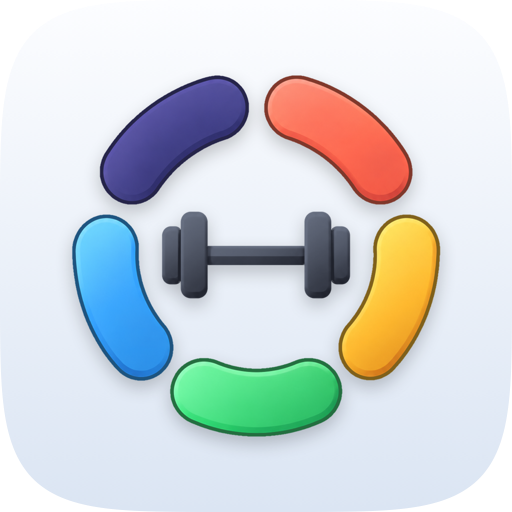
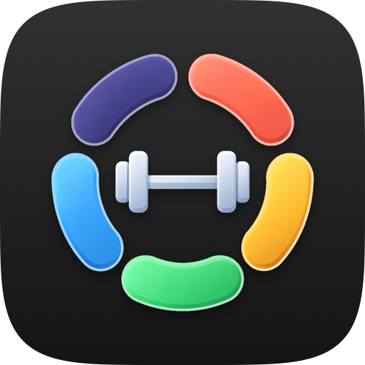
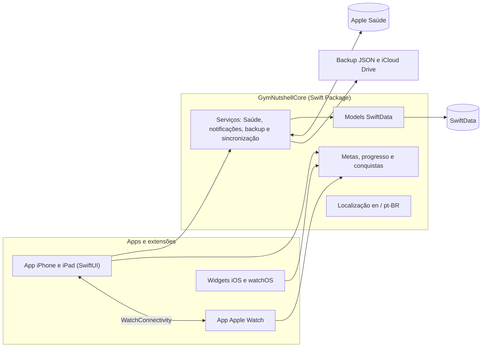
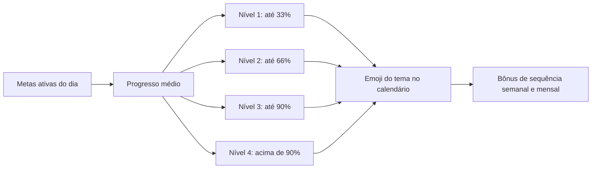

# Gym Nutshell

_Rastreie metas de nutrição, sono, suplementos e libere conquistas._

O Gym Nutshell nasceu da minha rotina de academia. Eu precisava lembrar de bater a meta de proteína, água, fibras e creatina, e ainda registrar cardio e sono, mas não achei nenhum app que fizesse tudo isso junto.

Durante o dia, você rastreia cada meta com sliders simples, incluindo calorias, carboidratos e gorduras, e recebe notificações durante o dia.

Para deixar o app um pouco mais divertido, cada dia completo vira uma conquista temática, com sequências e um calendário do seu progresso.

Ele é grátis, sem anúncios, sem assinatura e sem cadastro.

**Disponível na [App Store](https://apps.apple.com/us/app/gym-nutshell/id6774739305)** para iPhone, iPad, Apple Watch e Mac com Apple Silicon.

## Funcionalidades - Versão 1.0 
_(Algumas funcionalidades estão sendo removidas e outras aprimoradas na futura Versão 1.1)_ 

**Hoje**
- Metas do dia com registro rápido e anel de progresso geral.
- Botão de dia de descanso, que conta a meta como cumprida nos dias de pausa.
- Metas nas categorias Essencial, Nutrição, Treino e Suplemento, com ordem personalizável.

**Metas**
- Metas prontas: musculação, cardio, sono, água, calorias, proteína, carboidrato, gordura boa, fibra e creatina.
- Valores recomendados calculados a partir do peso, altura, idade, sexo e objetivo, com calorias pela fórmula de Mifflin-St Jeor.
- Metas e categorias personalizadas criadas pelo usuário.
- Unidades no sistema métrico ou imperial.

**Conquistas e temas**
- Quatro níveis de conquista por dia, conforme o progresso médio das metas.
- 19 temas em seis categorias (esporte, animais, lutadores, elementos, espaço e competição), cada um com seus emojis e nomes de nível, incluindo variações no feminino.
- Calendário mensal de conquistas, com histórico editável.
- Bônus de sequência semanais e mensais para quem mantém os níveis mais altos todos os dias.

**Progresso**
- Dias registrados, pontos e bônus acumulados.
- Quantidade de dias em cada nível, atividade recente e resumo das metas e dos dados físicos.

**Apple Watch**
- App próprio com o progresso do dia, as metas, as estatísticas e o histórico de notificações.
- Sincronização nos dois sentidos com o iPhone.
- Complicações para o mostrador nos formatos circular, retangular, de canto e em linha.

**Widgets**
- Progresso (pequeno, médio e na tela bloqueada), Calendário e Metas (grandes).
- Fundo do widget configurável.

**Apple Saúde**
- Leitura dos treinos para marcar musculação e cardio automaticamente.
- Registro das horas de sono no app Saúde.
- Permissões pedidas sob demanda, só para o que o usuário ativar.

**Lembretes**
- Notificações locais por meta, com intervalo configurável e horário limitado ao período do dia.
- Histórico das notificações recebidas.

**Dados e personalização**
- Backup em JSON para exportar e importar, compatível com a versão Android.
- Backup automático diário no iCloud Drive.
- Cores de destaque configuráveis e bloqueio de orientação da tela.
- Interface em Português do Brasil e English, conforme o idioma do sistema.
- Suporte a VoiceOver, modo claro e modo escuro.
- Disponível para iPhone, iPad e Mac com Apple Silicon.

## Arquitetura



- **SwiftUI** em toda a interface, no padrão **MV** (Model-View): o estado mora nas próprias views e em poucos stores `@Observable` por domínio, sem camada de ViewModel.
- **SwiftData** para persistência local.
- **GymNutshellCore**: Swift Package local compartilhado pelos cinco alvos (app iOS, app watchOS, widgets iOS, widgets watchOS e testes). Concentra models, cálculo de metas, conquistas, serviços e a localização, que é um catálogo único para todos os alvos.
- **HealthKit**, **WidgetKit**, **WatchConnectivity**, **AppIntents** e **UserNotifications** para a integração com o sistema.
- Anéis e barras de progresso desenhados com shapes do SwiftUI, sem bibliotecas de gráficos.
- Nenhuma dependência externa: apenas frameworks nativos da Apple.

### Do check-in à conquista



## Estrutura do repositório

```text
GymNutshell/
├── GymNutshellApp/            App iPhone e iPad
│   ├── Views/                 Telas por área: Hoje, Conquistas, Progresso, Ajustes e boas-vindas
│   ├── Helpers/               Delegate do app e bloqueio de orientação
│   └── Resources/             Assets, Info.plist e textos do sistema localizados
├── GymNutshellWatch/          App Apple Watch
├── GymNutshellWidget/         Widgets do iPhone
├── GymNutshellWatchWidget/    Complicações do Apple Watch
├── GymNutshellCore/           Swift Package com o domínio do app
│   ├── Sources/GymNutshellCore/
│   │   ├── Models/            Registros diários, bônus, temas, perfil e backup
│   │   ├── Goals/             Metas padrão, cálculo das metas e ordem de exibição
│   │   ├── Services/          Saúde, notificações, backup, iCloud e sincronização com o Watch
│   │   ├── Stores/            Metas personalizadas, categorias, preferências e dados dos widgets
│   │   ├── Migrations/        Migrações de dados
│   │   ├── Accessibility/     Apoio ao VoiceOver
│   │   └── Resources/         Localização en e pt-BR
│   └── Tests/                 Testes do Core
└── GymNutshell.xcodeproj
```

## Requisitos

- iOS 18 ou superior e watchOS 11 ou superior.
- Xcode com Swift 6.3 ou superior.

Para executar em um aparelho, selecione o seu Team e configure em **Signing & Capabilities** o HealthKit, o container do iCloud e o App Group usado pelos widgets.

## Privacidade

O Gym Nutshell não exige cadastro e não coleta dados. As informações ficam no próprio dispositivo e, quando o backup está ativo, no iCloud Drive do usuário. Os dados de saúde ficam no app Saúde e só são lidos ou gravados com a permissão do usuário. Não há servidores próprios, ferramentas de análise ou anúncios.

## Android

Existe também uma versão nativa para Android, feita em Kotlin e Jetpack Compose: [gymnutshell-android](https://github.com/jonathaxs/gymnutshell-android).

## Autor

Desenvolvido por **Jonathas Motta** ([@jonathaxs](https://github.com/jonathaxs)).
